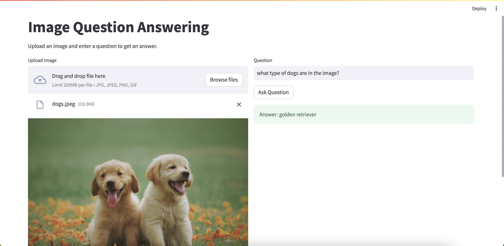

# Visual Question Answering
A sample python app to answer questions about an image.

## Types of apps
- CLI in `app.py`
- Streamlit in `app-with-gui.py`

## How to use
- Clone the repo.
- Make sure you have `poetry` installed, and run `poetry install`.
- Run the CLI app with `poetry run python3 app.py`.
- Run the streamlit app with `poetry run streamlit run app-with-gui.py`;

## Streamlit app
